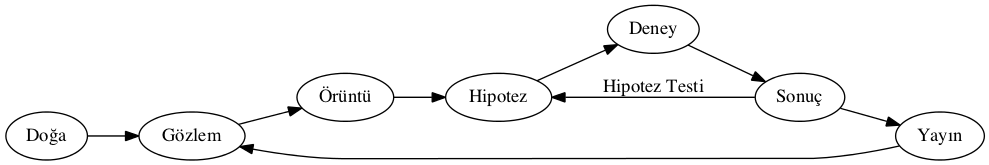
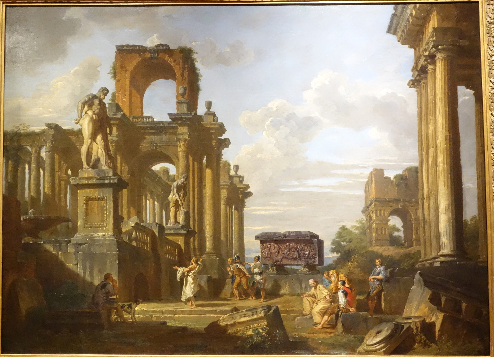
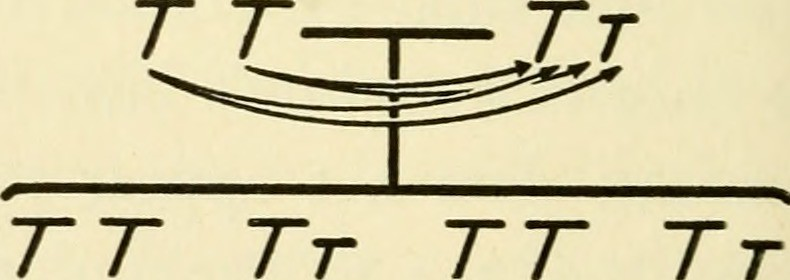
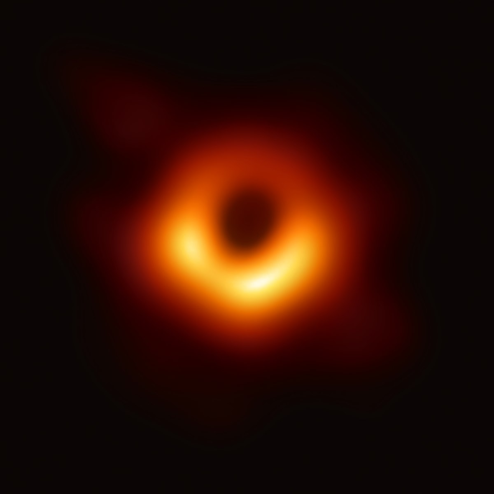
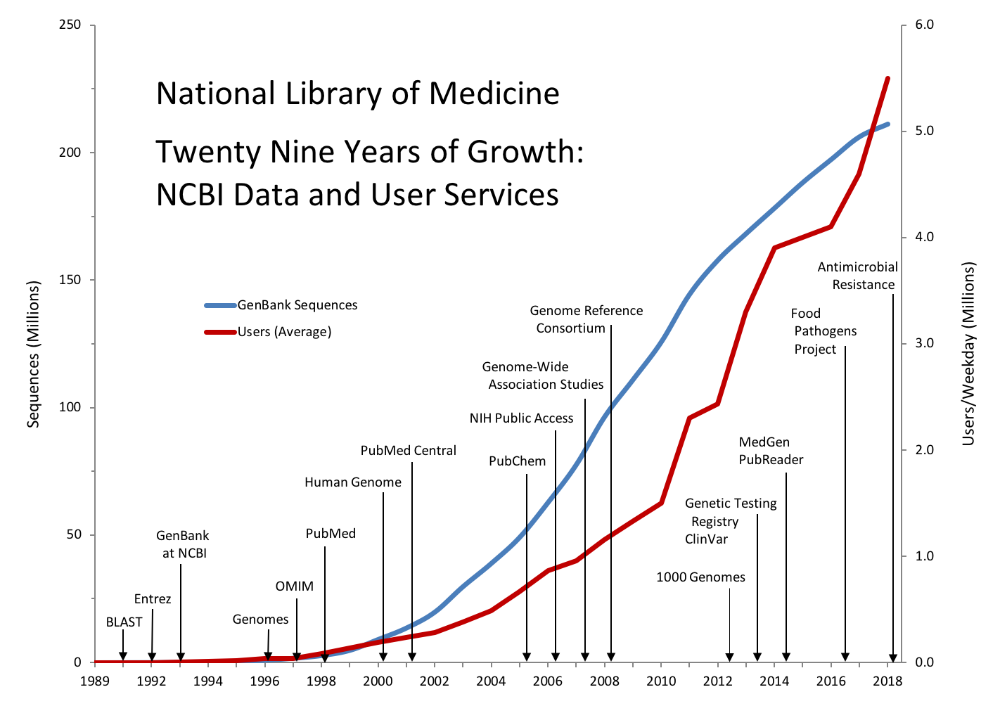
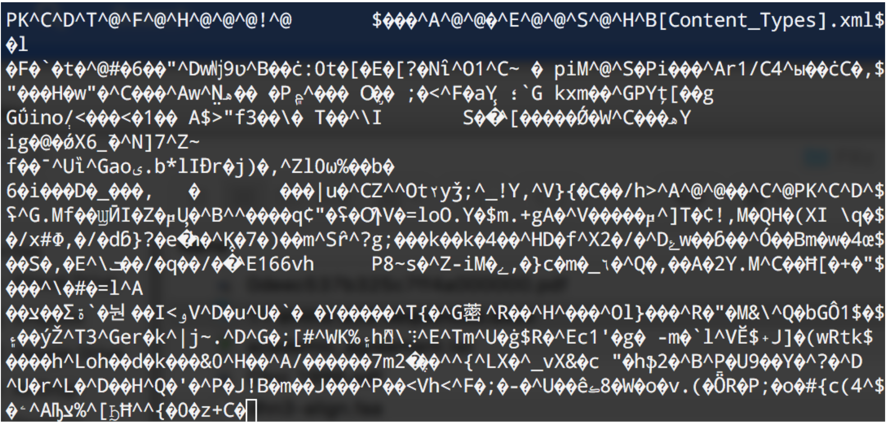

```{r setup, include=FALSE}
knitr::opts_chunk$set(echo = FALSE)
```

# Hoşgeldiniz

## Ders hakkında bilgiler

Derse katılım teşvik edilir!

Derse katılım: Aktif dinleme, ve uygulama


## İşleyiş

Dersin işleyişi:

- Teorik
- Pratik: aktif olarak katılımınız önemli!
- Bir önceki haftadan sorular
- Discord grubuna mutlaka katılın! (sorularınızı oradan soracaksınız)

Ödevler (5-7 arasında):

- Tartışma serbest
- Tam karar vermedim ama ödevler olabilir!
- Ödevleri tam zamanında yüklemelisiniz!

# Neden Veri Analizi? (ne anlıyorsunuz?)

## Bilimsel Yöntem

- Gözlemlerden, hipotezler türetiriz
- Hipotezleri test ederiz

```{r fig.cap="Bilimsel yöntemin şematize edilmesi", fig.width = 6, fig.asp = 0.618, fig.align="center"}

```

# Bilimde dört paradigma (Microsoft'a göre)

## Emprik (Deneysel)

İlk çağ filozofları:

- Doğayı gözleyerek modeller oluşturmuş
- Botanik, yıldız isimleri

```{r fig.cap="Antik çağlar...", out.width= "60%", fig.align="center"}

```

## Teorik

Matematiksel modellere dayanan:

- Matematiksel terimlerle ifade edien soyut kavramlar

```{r fig.cap="Mendel tarafından geliştirilen kalıtım modelleri", out.width= "70%", fig.align="center"}

```

## Benzetim (Simülasyon) tabanlı

Kesin olarak hesaplanamayan olgular:

- Protein katlanması, karadelik fotoğrafı

```{r fig.cap="Karadeliğin fotoğrafı, aslında gerçek bir fotoğraf değil", out.width= "50%", fig.align="center"}

```

## Veri temelli

Veride bulunan saklı örüntüleri incelemek ve bu örüntüler yardımıyla yeni hipotezler kurmak.

Veri -> Gözlem

## Veri Bilimi

Yaşam bilimlerinde genel süreç:

- Hipotez kur
- Deney yap
- Sonuç elde et!

## NCBI GenBank veritabanı

```{r fig.cap="NCBI genbank veritabanında gözlenen büyüme", out.width= "70%", fig.align="center"}

```

## Kısıt!

Ancak bu kadar veriyi analiz edecek insan sayısı az!

Geleceğin mesleği (on yıl sonra yerini başka bir geleceğin mesleğine devretmek üzere!)

# Neden Veri Bilimi?

## Verinin sakladığı gizemler

- Bilimsel yöntem genelde gözlemden sonuca gider
- Ancak artık sonuçtan gözleme gidiyoruz!

# Bilgisayarlar

## Bilgisayarlar

- Adı üstünde bilgi sayar
- Temel işi saymak
- Sadece sayısal bilgi işleyebilir
- Genelde sayılar birşeyleri temsil eder

## Sayılar neyi temsil eder?

Harfleri:

- A, B, C, d, e

Notaları

## Sayılar neyi temsil eder?

```{r fig.cap="Kedileri", out.width= "70%", fig.align="center"}
knitr::include_graphics("images/catsGresycale.jpg")
```

## Sayılar neyi temsil eder?

```{r fig.cap="Gri skladaki her renk 0 - 255 arasında bir sayı ile temsil edilir.", out.width= "70%", fig.align="center"}
knitr::include_graphics("images/greyscale3.jpg")
```

## Sayılar neyi temsil eder?

DNA'yı:

TCTAGCTAGCTAGCTAGCTAGC
TAGCTAGCTAGCTAGCTAGCTA
GCTAGCTAGTCAGTCGTACGTA
GCTAGCTAGCTAGCTAGTCGAT
CGATCA

## Sayılar neyi temsil eder?

Proteinleri:

QYINQSICIIYYMCTIKFSLWF
LPGTKVCRCPVIQYDKFTRGYG
LACTEEVATAQRYSRTIVRLWC
EPKNRHCRGRDKNEGSLHASMF
YQDTCWDDPYRLFKERYRCMPT
NAQLTWTYYW


## Bilgisayarlar bu verilerle ne yapar?

Veriler bilgisayarlar yardımıyla işlenir

Bir konumdan başka bir konuma iletilir ve ve dönüştürülmesi

Verilerin uzun süreli depolanması

## Bilgisayarlar

```{r fig.cap="Bilgisayarın parçaları", out.width= "70%", fig.align="center"}
knitr::include_graphics("images/comp_parts.png")
```

## CPU

Bilgisayarın temel bilgi işleme birimi.

Bütün parçalar arasındaki koordinasyonu sağlamaktan sorumlu

**Bir orkestra şefi gibi**

## RAM

Rastgele hafıza erişimi (Random Access Memory).

Bilgisayardaki birincil hafıza birimi. Sadece aktif olarak kullanılan veriler depolanır.

Ancak kısa süreldir ve kalıcılığı yoktur. Enerji kesildiğinde silinir.

## Harddisk

İkincil depolama birimi olarak kullanılır.

Uzun süreli bir depolama sağlar. 

Ucuz ancak yavaş bir depolama birimi.

## Dosyalar

Sayıları depoladığımız listeler. Her dosyanın:

- ismi
- oluşturulma tarihi
- boyutu
- kullanım hakları

bulunur

## Dosya isimleri

Bir karakter listesi:

- harfler
- numaralar
- semboller
- 250 karater uzunluğunda olabilir

Aşağıdakiler hariç:

- **Türkçe karakter ve boşluk!**
- **/, :, +, |, <, *, >, " ve ' **

## Dosya isimleri

Unix/Linux sistemlerde büyük ve küçük harfler farklıdır.

Her dosyanın uzantısı vardır (zorunlu değil ama anlaşılmayı kolaylaştırır):

- exe
- jpg
- doc
- txt

## Dosya tipleri

Temel olarak iki tip dosya var:

- Metin dosyaları
  - Sadece düz metin içerirler
  - Anlaşılabilir
  
- İkili dosyalar
  - Sayısal bilginin ikili şekilde düzenlenmiş hali
  - ses, resim dosylaları

## Metni ifade etmek

En basit metin gösterim metodu her bir karakteri tek bir bit ile ifade etmek

İngilizce için ASCII isimli bir kodlama var

Sıfır - 127 arasındak her numara bir *sembol* veya bir *sinyal* olarak ifade edilir:

+ Yeni satır
+ Tab
+ boşluk
+ Silme tuşu

## ASCII code

| |30|40|50|60|70|80|90|100|110|120
--|--|--|--|--|--|--|--|---|---|---
 0|  | (| 2|\<| F| P| Z| d | n | x
 1|  | )| 3| =| G| Q|[ | e | o | y
 2|  |  | 4|\>| H| R|\\| f | p | z
 3| !| +| 5| ?| I| S| ]| g | q | {
 4| "| ,| 6| @| J| T| ^| h | r |\|
 5| #| -| 7| A| K| U|  | i | s | }
 6|\$| .| 8| B| L| V|\`| j | t | ~
 7| %| /| 9| C| M| W| a| k | u | |
 8|\&| 0| :| D| N| X| b| l | v | |
 9| ´| 1| ;| E| O| Y| c| m | w | |

Non-English languages use numbers between 128 and 255 for symbols like "Ç", "Ö", "É", "Ñ"

## Metin dosyaları

```{r fig.cap="Düz metin dosyaları rahatlıkla okunabilir", out.width= "80%", fig.align="center"}
knitr::include_graphics("images/text.png")
```


## İkili dosyalar

```{r fig.cap="İkili bir dosya", out.width= "80%", fig.align="center"}

```

## Daha fazla bilgi için

+ Help -> Markdown Quick Reference
+ <https://www.rstudio.org/links/r_markdown_cheat_sheet>
+ <https://www.rstudio.org/links/r_markdown_reference_guide>
+ <http://rmarkdown.rstudio.com/>
+ Google "Markdown"

## Teşekkür

- Sunumlarından faydalanmama izin veren Dr. Andres Aravena'ya teşekkürler

