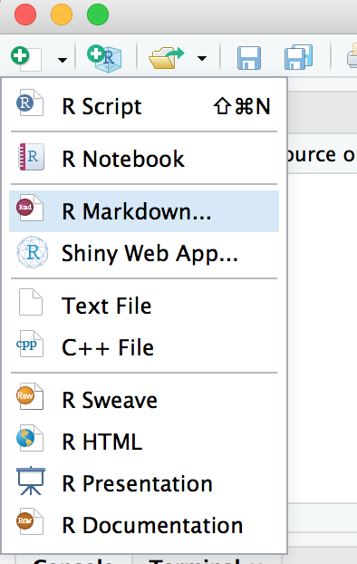

```{r setup, include=FALSE}
knitr::opts_chunk$set(echo = FALSE)
```

# R ve RStüdyo

## Rstüdyo

```{r fig.cap="Rstüdyo karşılama ekranı", out.width= "90%", fig.align="center"}
knitr::include_graphics("images/4panes.png")
```

## Rstüdyo + Rmarkdown

**File → New File → R Markdown** yolunu izleyin lütfen

```{r fig.cap="Yeni bir döküman", fig.align="center"}

```

## Bir Metin Editörü

Bu işlemin sonucunda bir metin editörü açılacak.

Metin editörleri yazılan metni hiçbir format değişimine bağlı kalmadan kaydeder.

Her karakter tek bir *bit* uzunluğa sahip olur 

**Renkler** ise genel olarak okumayı kolaylaştırmak için kullanılır

**Ancak bu Mikrosoft(!) Word değil!**

# Yapılandırılmış Metinler

## Yapılandırılmış Metinler

Bugün daha çok yapılandırılmış metinleri inceleyeceğiz.

Bir makaleye baktığınızda belirli bir yapı görürsünüz.

## Yapılandırılmış metinler

```{r fig.cap="Bir makale yapılandırılmış bir metindir", out.width= "80%", fig.align="center"}
knitr::include_graphics("images/artikel.png")
```

## Yapılandırılmış Metinler

- Harflerden kelimeler
- Kelimelerden cümleler
- Cümlelerden paragraflar
- Listeler
- Çizelgeler
- Şekiller
- Referanslar

## Sorun

Genelde metin editörleri WYSIWYG (Gördüğünü Al) felsefesine göre çalışır.

Yani düzenleyici metin boyutunu, renkleri ve diğer özelikleri belirleme hakkına sahiptir.

## Metin İçeriğinin ve Stilin Ayrılması

Hem yazıp hem de metin düzenlemek çok vakit alır.

Bunun yerine ilk önce içeriği düz bir metin dosyasında yazıp metni yayımlamadan önce stil işleriyle uğraşmaktadır.

+ WYSIWYG: Gördüğün gibi al
    + Microsoft Word
+ Alternatif: *Anlatmak istediğin şeyi al*
    + Önce kendinizi ifade edin
    + Bırakın program stilleri ayarlasın

## Yapısal Öğeler

+ Kısımlar
+ Altkısımlar
+ Paragraflar
+ Listeler
    + Numaralı
    + Numarasız
+ Kodlar

## Yapısal Öğeler

+ Şekiller
    + Şekil açıklamaları
+ Tablolar
    + Başlıklar
    + Sütunlar
+ Referanslar
+ Önbilgi

## Stil elementleri

+ Renk
+ Font
+ Font büüyklüğü
+ Hizalama
+ Bölümler

# RMarkdown ile Yazım

## Markdown

Metin yazımı için alternatif bir yol. Bu sistemde metni yazarken belirli stil elementlerini özel işaretlerle belirliyoruz.

Bu sayede metinler istenen her bilgisayarda okunabilir!

Ancak bazı kurallar var.

## Paragraflar

Hiçbir belirteç kullanılmadan yazılmış metinler paragraf stiline dönüştürülür.

```
Bir paragraf

Başka bir paragraf.
```

> Bir paragraf
>
> Başka bir paragraf.

## Başlıklar
```
Birinci seviye başlık
==================

İkinci seviye başlık
-------------------

Paragraf
```

> <div style="font-size: 150%;font-weight: bold;">Birinci seviye başlık</div>
> <div style="font-size: 120%;font-weight: bold;">İkinci seviye başlık</div>
> Paragraf


## Başlıklar

```
# Başlık 1
## Başlık 2
### Başlık 3
#### Başlık 4
```

> <div style="font-size: 150%;font-weight: bold;">Başlık 1</div>
> <div style="font-size: 120%;font-weight: bold;">Başlık 2</div>
> <div style="font-size: 120%;font-style: italic;">Başlık 3</div>
> <div style="font-size: 110%;font-family: cursive;">Başlık 4</div>

## Listeler
```
+ Öğe1 1
+ Öğe2 2
    + Öğe 2a
    + Öğe 2b
```

<blockquote>
+ Öğe 1
+ Öğe 2
    + Öğe 2a
    + Öğe 2b
</blockquote>

Alt listeler 4 tane boşlukla oluşturulur

## Numaralı listeler

```
1. Öğe 1
1. Öğe 2
1. Öğe 3
    1. Öğe 3a
    1. Öğe 3b
```

<blockquote>
1. Öğe 1
1. Öğe 2
1. Öğe 3
    1. Öğe 3a
    1. Öğe 3b
</blockquote>

## Alıntılar

ALıntı yapmak için:

```
> "The limits of my language mean
> the limits of my world"
> 
> *Ludwig Wittgenstein*
```


<blockquote style="background: bisque;">
<p>"The limits of my language mean the limits of my world"</p><p><em>Ludwig Wittgenstein</em></p>
</blockquote>

## Şekiller

İnternetten: 

```

```

Veya bilgisayarınızdaki bir dosyadan:

```

```


## Çizelgeler

```
|        | sample   | dose | time   | agent            |
|--------|----------|------|--------|------------------|
| 1      | GSM91440 | low  | 5 min  | caffeine         |
| 2      | GSM91893 | low  | 5 min  | caffeine         |
| 3      | GSM91428 | low  | 5 min  | calcofluor white |
| 4      | GSM91881 | low  | 5 min  | calcofluor white |
```

|        | sample   | dose | time   | agent            |
|--------|----------|------|--------|------------------|
| 1      | GSM91440 | low  | 5 min  | caffeine         |
| 2      | GSM91893 | low  | 5 min  | caffeine         |
| 3      | GSM91428 | low  | 5 min  | calcofluor white |
| 4      | GSM91881 | low  | 5 min  | calcofluor white |

## Kodlamalar

Programlar genel olarak *sabit genişlikli* bir yazı tipiyle yazılır.

~~~
```
this <- is.computer(code)
```
~~~

> `this <- is.computer(code)`

Bu özellik dersin ilerleyen aşamalarında  **çok önemli** olacak.

# Başlık and Üstveri

## Her dosyanın başında

```
---
title: "Başlık"
author: "İsim"
date: "Tarih"
output: html_document
---
```
Bu bloğun üç tane kesme işaretiyle ayrıldığına dikkat edin: 

`---` 

## Bağlantılar

```
Bu bir [bağlantıdır](http://example.com).
Daha açık bir [şekilde de yazılabilir].

[Daha açık bir şekil]: http://example.com
```

> Bu bir [bağlantıdır](http://example.com).
> Daha açık bir [şekilde de yazılabilir].

[Daha açık bir]: http://example.com

## Kod yazımı

```
Kodlar `bu şekilde` yazılır
```

> Kodlar `bu şekilde` yazılır


## Alıştırma vakti

Bu derste öğrendiklerinizi Rmarkdown olarak yazın lütfen.

## Daha fazla bilgi için

+ Help -> Markdown Quick Reference
+ <https://www.rstudio.org/links/r_markdown_cheat_sheet>
+ <https://www.rstudio.org/links/r_markdown_reference_guide>
+ <http://rmarkdown.rstudio.com/>
+ Google "Markdown"

## Teşekkür

- Sunumlarından faydalanmama izin veren Dr. Andres Aravena'ya teşekkürler!

